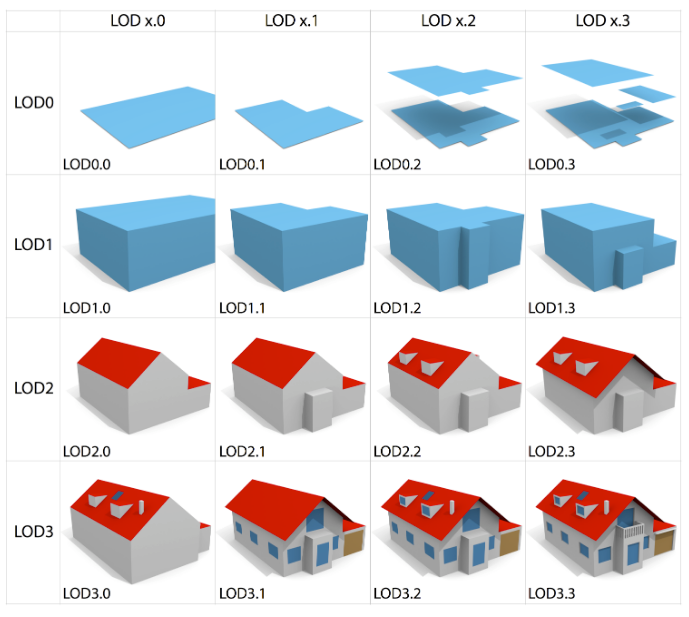

# Meer inhoud

## Definities
<dfn>LOD</dfn>: Een definitie is een beschrijving van een woord. Een ander woord voor _definitie_ is betekenis of beschrijving.

## Afbeeldingen

Afbeeldingen krijgen een nummer en vermelding in de figurenlijst [[[#tof]]].

")

<figure id="refined-lods">
  

  <figcaption>
    Refined LoDs for CityGML Buildings. Bron: [[Biljecki16c]].
  </figcaption>
</figure>

## Referenties

Referenties kunnen op drie plaatsen staan:

- In SpecRef [Specref](https://www.specref.org/)
- In de organisatie configuraties [[SemVer]]. Deze zijn te vinden op [tools.geostandaarden.nl](https://github.com/Geonovum/tools.geostandaarden.nl/blob/main/tools.geostandaarden.nl/respec/config/geonovum-config.js).
- In het document, zoals [[MIM12]]. Deze zijn te vinden in `js/config.js`.

Referentie uit organisatie lijst [[SemVer]] of de locale lijst [[MIM12]]. Lijst staat in `organisation-config.js`. Alleen referenties die in de tekst voorkomen worden getoond.

We gebruiken een <a>definitie</a> om een woord te omschrijven.